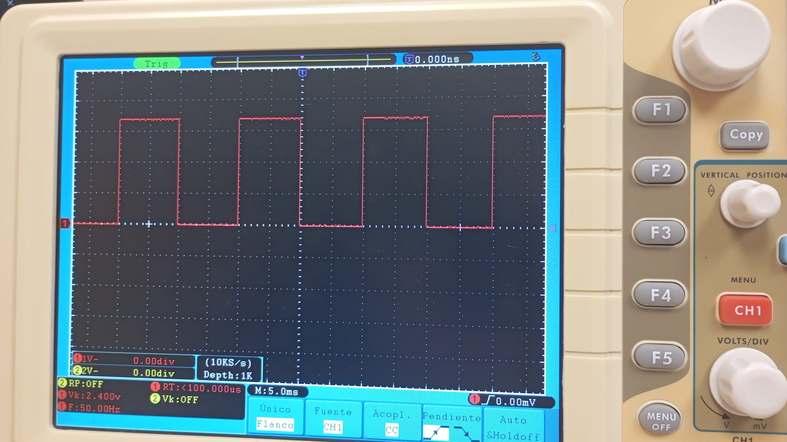
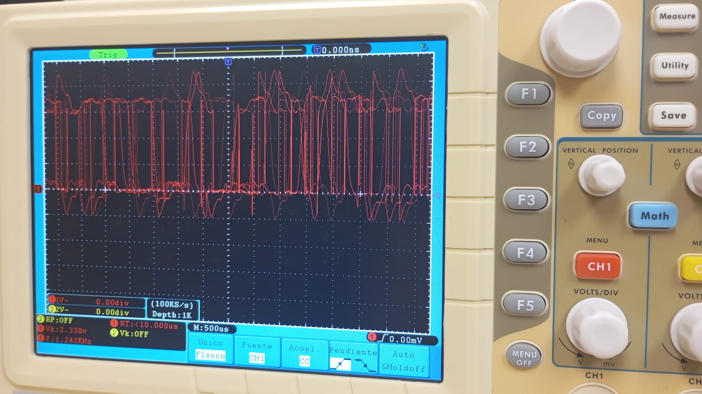

# Informe de la Práctica de Laboratorio 1

## Introducción

En este informe se describe el trabajo realizado durante la primera práctica del laboratorio, que tuvo como objetivo familiarizarnos tanto con el entorno de desarrollo Visual Studio Code, utilizando la extensión PlatformIO, como con la placa Arduino ESP32-S3. Esta primera toma de contacto nos permitió explorar las funcionalidades básicas del hardware y software.

---

## Instalación y Configuración Inicial

El primer paso fue instalar la extensión **PlatformIO** dentro de Visual Studio Code, que es un entorno integrado que facilita la programación de placas de desarrollo como la ESP32-S3. Una vez instalada la extensión, conectamos la placa al ordenador y configuramos el entorno para poder compilar y cargar programas en el microcontrolador.

---

## Desarrollo de los Programas

Para esta práctica, desarrollamos dos programas principales con ayuda de una inteligencia artificial que nos proporcionó el código base:

1. **Control del LED RGB integrado:**
   - El programa cambia el color del LED RGB entre tres colores diferentes de manera cíclica.
   
2. **Encendido y apagado del LED:**
   - Este programa alterna el encendido y apagado del LED, mostrando en la consola mensajes indicativos de su estado ("LED encendido" o "LED apagado").
   - Además, conectamos la salida del LED a un osciloscopio para analizar las frecuencias generadas con diferentes valores de delay.

---

## Funcionalidades Adicionales del LED

Además de los programas básicos, solicitamos a la inteligencia artificial sugerencias para implementar diferentes efectos con el LED. Algunas funcionalidades interesantes fueron:

- **Waving:** Un efecto en el que el LED cambia de color suavemente, apagándose y encendiéndose de forma progresiva para simular un movimiento de "oleaje" en la luz.
- **Arcoíris:** Un efecto en el que el LED cambia entre varios colores de manera intermitente, simulando un espectro de colores tipo arcoíris.

Estos efectos nos permitieron experimentar con técnicas de control de intensidad y temporización más avanzadas.

---

## Análisis con Osciloscopio

Para complementar el estudio, conectamos la salida del LED a un osciloscopio y realizamos mediciones con diferentes configuraciones de delay para observar cómo afectaba al comportamiento de la señal. A continuación, se muestran dos imágenes tomadas durante la práctica:

### Imagen 1: Osciloscopio con delay de 500 ms  

### Imagen 2: Osciloscopio sin delay  

Estas imágenes ilustran claramente las variaciones en la señal del LED según el delay aplicado, confirmando el correcto funcionamiento de los programas.

---

## Conclusiones

La primera práctica fue una experiencia muy útil para familiarizarnos con la programación de microcontroladores utilizando Visual Studio Code y PlatformIO. La integración del hardware con el software y la utilización de herramientas de medición como el osciloscopio nos permitió comprender mejor el comportamiento del sistema.

Además, la ayuda de la inteligencia artificial para generar código facilitó el desarrollo y nos mostró nuevas formas de explorar las funcionalidades del LED RGB integrado en la placa ESP32-S3.

