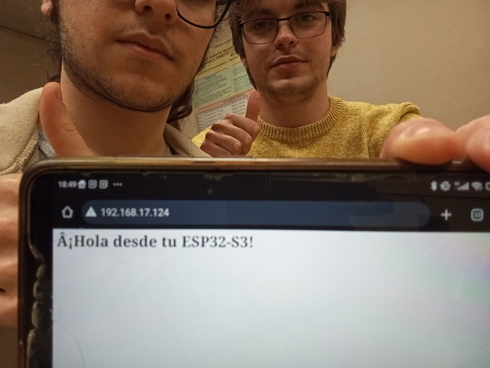
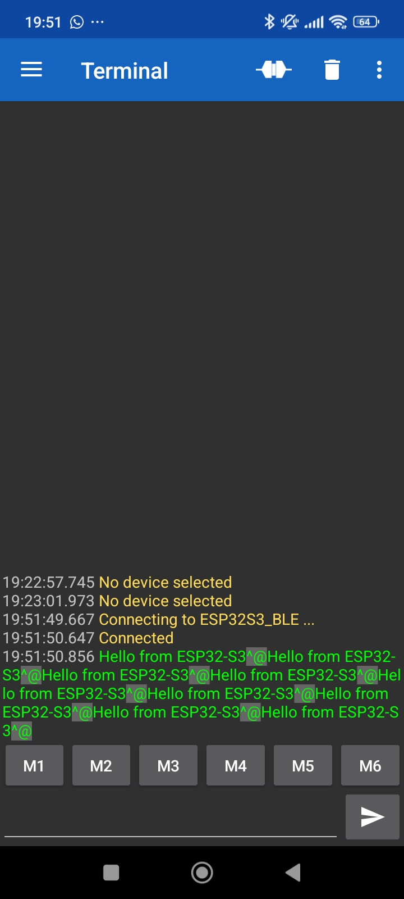

# Informe de la Práctica de Laboratorio 3

## Introducción

En este informe se detalla el trabajo realizado durante la tercera práctica del laboratorio, cuyo enfoque principal fue el uso de la antena integrada de la placa ESP32-S3 para establecer comunicaciones inalámbricas mediante **WiFi** y **Bluetooth Low Energy (BLE)**.

Esta práctica marca el inicio del trabajo con conectividad inalámbrica, permitiéndonos explorar cómo la placa puede interactuar con otros dispositivos, servidores web o aplicaciones móviles.

---

## Objetivos

- Establecer una conexión WiFi desde la ESP32-S3 y mostrar un mensaje mediante un servidor web local en HTML.
- Establecer una conexión Bluetooth Low Energy (BLE) entre la ESP32-S3 y un teléfono móvil mediante la aplicación externa *Serial Bluetooth Terminal*.
- Comprobar la funcionalidad de ambas interfaces inalámbricas a través de ejemplos prácticos e imágenes demostrativas.

---

## Desarrollo de la Práctica

### 1. Comunicación vía WiFi

- **Configuración:**  
  Se programó la ESP32-S3 para que se conectara a una red WiFi local y actuara como servidor HTTP. Al acceder desde un navegador a la dirección IP asignada, la placa respondía con una página HTML básica mostrando un mensaje.

- **Resultado:**  
  Logramos una conexión exitosa con el navegador, que mostró correctamente el mensaje generado desde la ESP32-S3.

- **Aplicaciones prácticas:**  
  Este tipo de comunicación es útil para crear interfaces web que controlen dispositivos o muestren datos de sensores de forma remota.

 **Imagen demostrativa de la conexión por WiFi:**  

---

### 2. Comunicación vía Bluetooth Low Energy (BLE)

- **Configuración:**  
  Se configuró la placa para emitir una señal BLE y permitir que dispositivos cercanos pudieran detectarla. Utilizamos la aplicación *Serial Bluetooth Terminal* en un teléfono móvil Android para conectarnos.

- **Funcionamiento:**  
  Al establecer la conexión, la ESP32-S3 enviaba un mensaje al terminal del teléfono, confirmando que la comunicación era exitosa.

- **Ventajas:**  
  BLE permite conexiones de baja energía ideales para aplicaciones móviles, wearables o sensores portátiles.

 **Imagen del terminal mostrando la conexión BLE:**  

---

## Conclusiones

La tercera práctica fue clave para introducirnos en la conectividad inalámbrica de la ESP32-S3. Aprendimos a utilizar tanto la interfaz WiFi como BLE para intercambiar información entre la placa y dispositivos externos.
