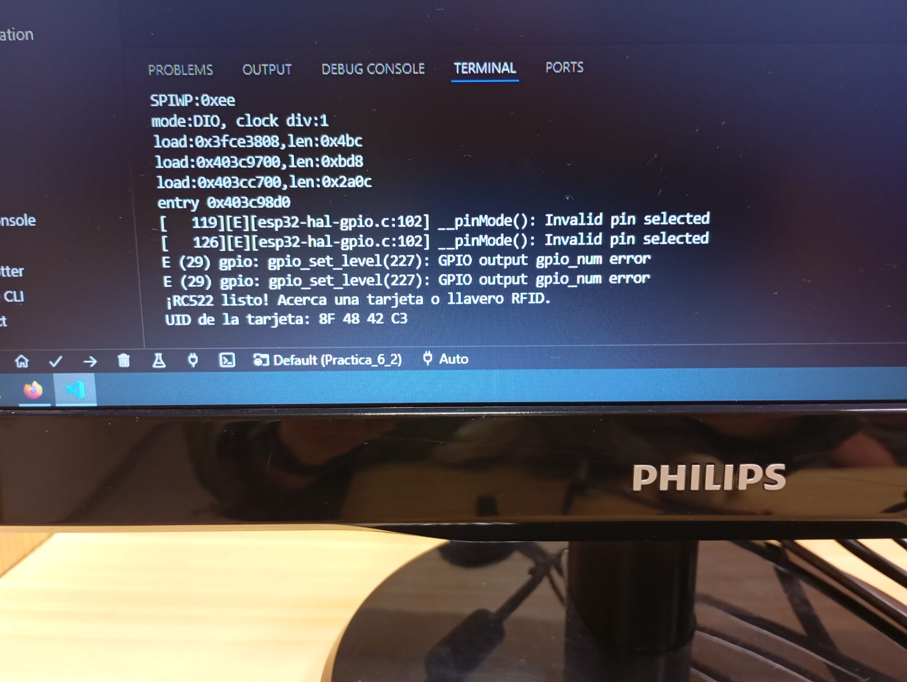

# Informe de la Práctica de Laboratorio 5: Buses de Comunicación II (SPI)

## Introducción

La práctica tuvo como objetivo principal comprender el funcionamiento del bus **SPI (Serial Peripheral Interface)**, un protocolo de comunicación ampliamente utilizado en sistemas embebidos. A través de esta práctica se estudiaron sus características fundamentales, sus ventajas frente a otros protocolos como I2C, y se implementaron distintos ejercicios utilizando microcontroladores **ESP32-S3** y dispositivos periféricos como **módulos SD** y **lectores RFID**.

---

## Desarrollo de la Práctica

Durante esta práctica se realizaron diversos ejercicios prácticos para aplicar los conceptos teóricos del bus SPI. Se utilizaron módulos fácilmente disponibles y compatibles con el ESP32, como lectores RFID y tarjetas SD.

### Ejercicio 1: Lectura de memoria SD

- **Objetivo:** Leer el contenido de un archivo almacenado en una tarjeta microSD.
- **Descripción:** Se utilizó un lector SD conectado al ESP32 mediante el bus SPI. El sistema intenta inicializar la tarjeta, y si tiene éxito, accede a un archivo de texto y muestra su contenido por el monitor serie.
- **Tareas solicitadas:**
  1. Describir la salida mostrada por el monitor serie.
 

---

### Ejercicio 2: Lectura de etiquetas RFID

- **Objetivo:** Detectar tarjetas RFID y leer su identificador único (UID).
- **Descripción:** Se conectó un lector RFID RC522 mediante SPI. Al acercar una tarjeta RFID, el sistema la detecta y muestra su UID por el monitor serie.
- **Tareas solicitadas:**
  1. Observar y registrar la salida por el puerto serie al acercar una tarjeta.
  2. Explicar el proceso de detección y lectura del UID.

## Conclusiones

La práctica permitió profundizar en el uso del protocolo SPI para la comunicación entre el microcontrolador y distintos periféricos. Se evidenció que:

- El bus SPI es ideal para aplicaciones que requieren alta velocidad de transmisión.
- La gestión adecuada de los pines SS es fundamental para evitar errores en la comunicación.
- Es posible combinar múltiples dispositivos SPI en un mismo proyecto, siempre que se controlen cuidadosamente sus líneas de selección.

Esta experiencia sienta las bases para proyectos más complejos que involucren múltiples sensores, almacenamiento externo o interfaces avanzadas.

---

## Anexos

- **Fotos del montaje:**
   
  
  
- **Salidas de depuración:** Capturas de pantalla del monitor serie.
  
   
---
