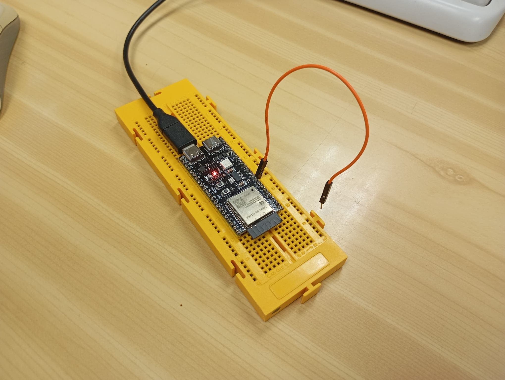

# Informe de la Práctica de Laboratorio 8: Buses de Comunicación IV (UART)

## Introducción

La octava práctica de laboratorio se centró en la comprensión y aplicación del protocolo de comunicación serie asíncrono **UART** (Universal Asynchronous Receiver Transmitter), fundamental en la comunicación entre microcontroladores y dispositivos periféricos.

---

## Marco Teórico

### Definición de UART/USART

- **UART** permite la transmisión y recepción de datos de forma asíncrona (sin señal de reloj).
- **USART** agrega además la posibilidad de comunicación síncrona (con señal de reloj).
- Es una comunicación **full duplex**, donde se puede emitir y recibir simultáneamente.

### UART en el ESP32-S3

El ESP32 posee **tres puertos UART**:
- **UART0:** GPIO3 (RX), GPIO1 (TX)
- **UART1:** GPIO9 (RX), GPIO10 (TX)
- **UART2:** GPIO16 (RX), GPIO17 (TX)

Los pines pueden reasignarse según sea necesario. Todos los UART trabajan a niveles lógicos de 3.3V.

---

## Desarrollo de la Práctica

### Ejercicio Práctico 1: Bucle de Comunicación UART2

- **Objetivo:** Redirigir la entrada del terminal UART0 (puerto serie principal) hacia la salida de UART2 y viceversa.
- **Implementación:** Se realiza un puente entre UART0 y UART2, permitiendo que cualquier dato enviado desde el monitor serie sea reenviado y luego devuelto a la pantalla.
- **Requisitos del informe:**
  - Incluir el código fuente funcional.
  - Describir su lógica.
  - Mostrar capturas de consola con entradas y salidas.

---

## Conclusiones

La práctica permitió:

- Entender los fundamentos de la **comunicación serie asíncrona UART**.
- Aplicar el redireccionamiento de puertos serie en el ESP32-S3.

---

## Anexos

- **Imagen del montaje:**

- **Imagen del funcionamiento:**
   
